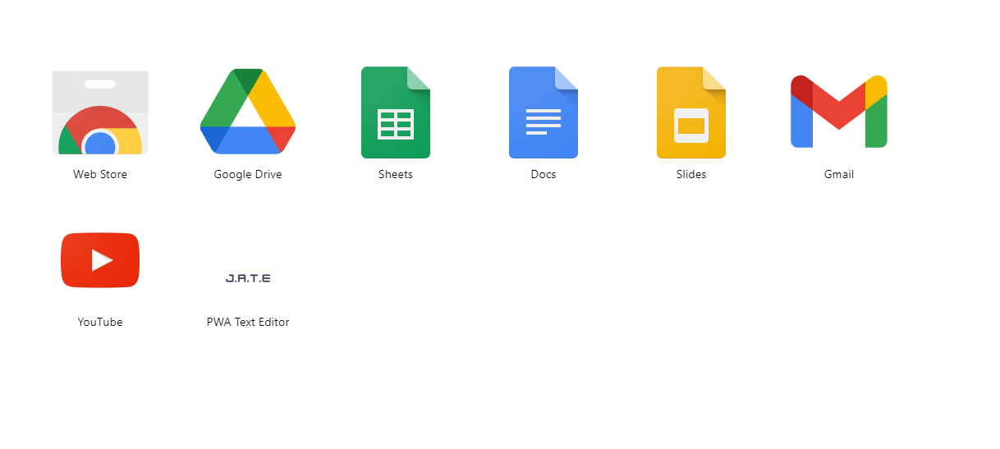
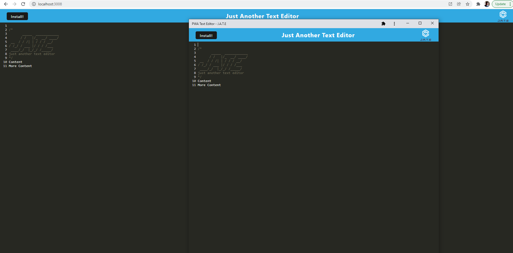

# PWA TEXT EDITOR

[](https://choosealicense.com/licenses/mit/)
[](https://github.com/HobbaZ/PWA-text-editor-1/commits)
[](https://github.com/HobbaZ/PWA-text-editor-1/branches)
[]()

[](https://img.shields.io/github/issues/HobbaZ/PWA-text-editor-1)


## Description
### Project Aim ###
Make a text editor with PWA functionality

### What I Learnt ###
- Use indexedDB npm package idb
- use idb to store and retrieve data
- Use webpack

## Deployment
You can view the [website link](https://boiling-meadow-89340.herokuapp.com/) here. 


## Table of Contents
- [Description](#description)
- [User Story](#user-story)
- [Screenshots](#screenshots)
- [Installation](#installation)
- [Features](#features)
- [Technology](#technology)
- [Contributors](#contributors)
- [Acknowledgements](#acknowledgements)
- [Testing](#testing)
- [License](#license)
- [Questions](#questions)

## User Story
```md
AS A developer
I WANT to create notes or code snippets with or without an internet connection
SO THAT I can reliably retrieve them for later use
```

## Acceptance Criteria
```md
GIVEN a text editor web application
WHEN I open my application in my editor
THEN I should see a client server folder structure
WHEN I run `npm run start` from the root directory
THEN I find that my application should start up the backend and serve the client
WHEN I run the text editor application from my terminal
THEN I find that my JavaScript files have been bundled using webpack
WHEN I run my webpack plugins
THEN I find that I have a generated HTML file, service worker, and a manifest file
WHEN I use next-gen JavaScript in my application
THEN I find that the text editor still functions in the browser without errors
WHEN I open the text editor
THEN I find that IndexedDB has immediately created a database storage
WHEN I enter content and subsequently click off of the DOM window
THEN I find that the content in the text editor has been saved with IndexedDB
WHEN I reopen the text editor after closing it
THEN I find that the content in the text editor has been retrieved from our IndexedDB
WHEN I click on the Install button
THEN I download my web application as an icon on my desktop
WHEN I load my web application
THEN I should have a registered service worker using workbox
WHEN I register a service worker
THEN I should have my static assets pre cached upon loading along with subsequent pages and static assets
WHEN I deploy to Heroku
THEN I should have proper build scripts for a webpack application
```

## Screenshots




## Installation
1. Clone the repo to your computer by clicking the green code button and copying the SSH version.

2. Open Gitbash in your desired folder and type ```git clone ``` then right click to paste the string and hit enter. The repo will then be cloned to your computer.

3. Navigate to the repo folder and type ```code .``` into gitbash to open the repo in VS Code.

4. Open a new Terminal in VS Code and type ```npm install``` to install the repo dependencies.

5. Finally, type ```npm start``` into the terminal and navigate to localhost:3008 in your web browser.

## Features
- PWA functionality
- Data persistance

## Technology

- Webpack
- Heroku
- React
- Babel

## Contributors
[Zachary Hobba](https://github.com/HobbaZ)

You can also contribute by opening a pull request or submitting an issue

## Acknowledgements
[https://www.npmjs.com/package/webpack-pwa-manifest](https://www.npmjs.com/package/webpack-pwa-manifest)

[https://developers.google.com/web/tools/workbox/reference-docs/latest/module-workbox-webpack-plugin.InjectManifest](https://developers.google.com/web/tools/workbox/reference-docs/latest/module-workbox-webpack-plugin.InjectManifest)

[https://hackernoon.com/use-indexeddb-with-idb-a-1kb-library-that-makes-it-easy-8p1f3yqq](https://hackernoon.com/use-indexeddb-with-idb-a-1kb-library-that-makes-it-easy-8p1f3yqq)

[https://github.com/jakearchibald/idb#opendb](https://github.com/jakearchibald/idb#opendb)

## Testing
No tests created.

## License

MIT

**Copyright 2021 Zachary Hobba**

Permission is hereby granted, free of charge, to any person obtaining a copy of this software and associated documentation files (the "Software"), to deal in the Software without restriction, including without limitation the rights to use, copy, modify, merge, publish, distribute, sublicense, and/or sell copies of the Software, and to permit persons to whom the Software is furnished to do so, subject to the following conditions:
The above copyright notice and this permission notice shall be included in all copies or substantial portions of the Software.
    
THE SOFTWARE IS PROVIDED "AS IS", WITHOUT WARRANTY OF ANY KIND, EXPRESS OR IMPLIED, INCLUDING BUT NOT LIMITED TO THE WARRANTIES OF MERCHANTABILITY, FITNESS FOR A PARTICULAR PURPOSE AND NONINFRINGEMENT. IN NO EVENT SHALL THE AUTHORS OR COPYRIGHT HOLDERS BE LIABLE FOR ANY CLAIM, DAMAGES OR OTHER LIABILITY, WHETHER IN AN ACTION OF CONTRACT, TORT OR OTHERWISE, ARISING FROM, OUT OF OR IN CONNECTION WITH THE SOFTWARE OR THE USE OR OTHER DEALINGS IN THE SOFTWARE.

## Questions

Find me on Github at [HobbaZ](https://github.com/HobbaZ)
Email me at [zachobba@gmail.com](zachobba@gmail.com)